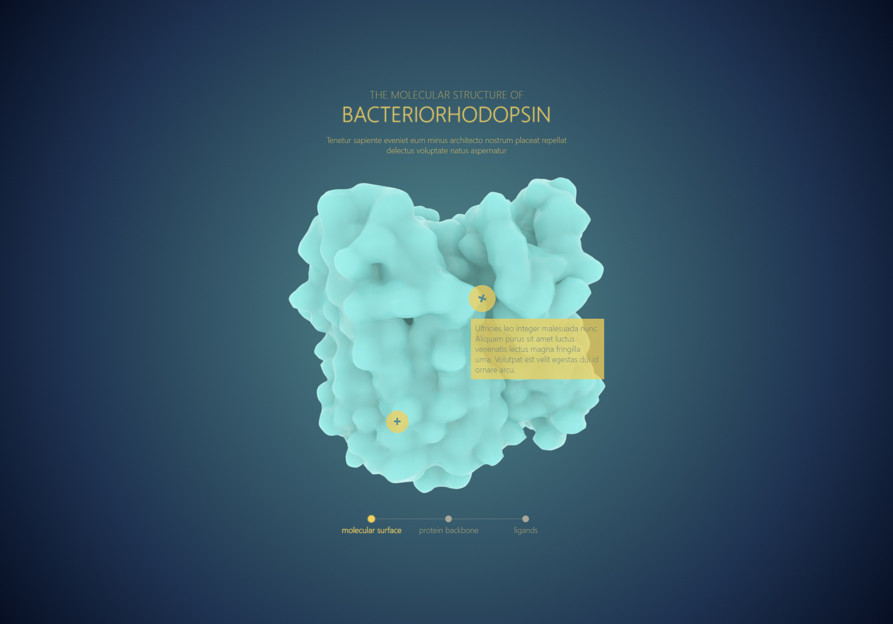

# Structure-of-Bacteriorhodopsin

**Project Name**: Molecular Structure of Bacteriorhodopsin 

**Purpose**: To transform a mockup into a webpage 

**Technology used**: HTML, CSS, UI-Kits

**Functionality**: 

| Functionality | Purpose |
|---------------|---------|
| toggles | interactive experience to provide a more in-depth explaination to certain aspect of the molecular surface of the protein |
| switcher | facilitate different views of the protein, each view highlights a different structural component of the protein |

## Mockup Image of project

**Acknowledgements** This project was created as an assignment for the HSC402H5: Digital Learning Environments in Biology and Health Science at the University of Toronto Mississauga. Source materials including the mock up was provided as course material. The HSC402 course focused on the "design, development and evaluation of digital learning environments for biology and health sciences education". 
